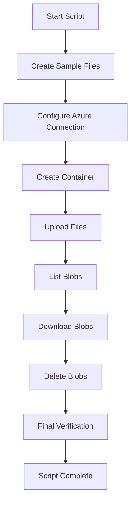

# Azure Blob Storage Python Demo

This project demonstrates basic operations on Azure Blob Storage using the Python SDK (`azure-storage-blob`). The script:

- Creates sample files for testing (.txt and .docx)
- Authenticates with Azure using DefaultAzureCredential
- Creates a container named `mytestcontainer`
- Uploads multiple file types to the container
- Lists all blobs in the container
- Downloads the blobs with a "downloaded_" prefix
- Deletes the blobs after downloading
- Performs final verification of local files

## Features

- Automatic creation of sample files (.txt and .docx with fallback)
- Secure authentication via DefaultAzureCredential
- Container creation with existence handling
- Multi-file upload supporting different types
- Blob listing with count summary
- Download and delete operations with error handling
- Final local file verification
- Comprehensive logging and status messages

## Prerequisites

- Python 3.8 or higher
- Azure account with a Blob Storage account
- Azure CLI installed and authenticated (`az login`)
- Required permissions: "Storage Blob Data Contributor" role on the storage account
- Python packages listed in requirements.txt

## Installation

### Clone the repository
```bash
git clone https://github.com/nishanttomar21/azure-storage-blob-demo.git
cd azure-storage-blob-demo
```

### Create and activate virtual environment (recommended)
```bash
python -m venv .venv
source .venv/bin/activate # On Windows: .venv\Scripts\activate
```

### Install dependencies
```bash
pip install -r requirements.txt
```

## Requirements

- azure-storage-blob
- azure-identity
- python-docx

## Usage

### 1. Set up Authentication:
```bash
az login
```

### 2. **Update the script** with your storage account URL: 
```bash
account_url = "https://<your_storage_account_name>.blob.core.windows.net/"
```

### 3. **Run the script**:
```bash
python main.py
```

### 4. **Expected Output**:
```bash
Created sample1.txt
Created sample2.docx

Authenticating with Azure...
Container 'mytestcontainer' created successfully!

Starting upload of 2 files...
Uploaded: sample1.txt
Uploaded: sample2.docx

Listing all blobs in container 'mytestcontainer':
   - sample1.txt
   - sample2.docx
   Total blobs: 2

Starting download process...
Downloaded 'sample1.txt' as 'downloaded_sample1.txt'
Downloaded 'sample2.docx' as 'downloaded_sample2.docx'

Deleting container 'mytestcontainer'...
Container 'mytestcontainer' deleted successfully!

Local files in directory:
   [FOUND] sample1.txt
   [FOUND] sample2.docx
   [FOUND] downloaded_sample1.txt
   [FOUND] downloaded_sample2.docx

Script execution completed!
```

## Flow Diagram



## Authentication & Permissions

The script uses `DefaultAzureCredential` for authentication, which supports:

- Environment variables
- Managed identities
- Azure CLI (recommended for local dev)

**Required Role**: Assign "Storage Blob Data Contributor" to your identity on the storage account via Azure Portal > Storage Account > Access control (IAM) > Add role assignment.

## Troubleshooting

- **Authentication failed**: Run `az login` and verify your subscription with `az account show`.
- **Permission errors**: Ensure "Storage Blob Data Contributor" role is assigned.
- **Missing python-docx**: Install with `pip install python-docx` or use the .txt fallback.
- **Container exists**: The script handles this gracefully; no action needed.

For more details, check Azure's [troubleshooting guide](https://learn.microsoft.com/en-us/azure/storage/blobs/storage-quickstart-blobs-python?tabs=managed-identity%2Croles-azure-portal%2Csign-in-azure-cli&pivots=blob-storage-quickstart-scratch#troubleshoot).

## Notes

- Update `account_url` and `container_name` as needed.
- The script overwrites existing blobs for re-runs.
- Binary mode ensures compatibility with non-text files.

## License

[MIT License](LICENSE)

## Acknowledgements

- [Azure SDK for Python](https://github.com/Azure/azure-sdk-for-python) – Blob Storage operations.
- [python-docx](https://python-docx.readthedocs.io/) – Word document generation.
- [Azure Identity](https://docs.microsoft.com/en-us/python/api/overview/azure/identity-readme) – Authentication library.
